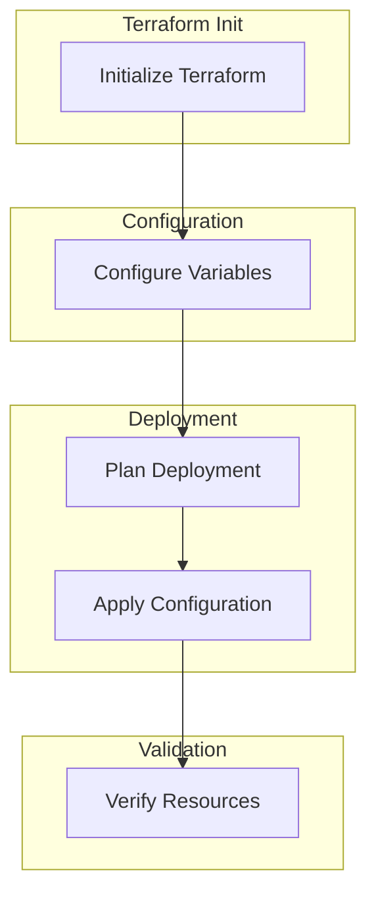
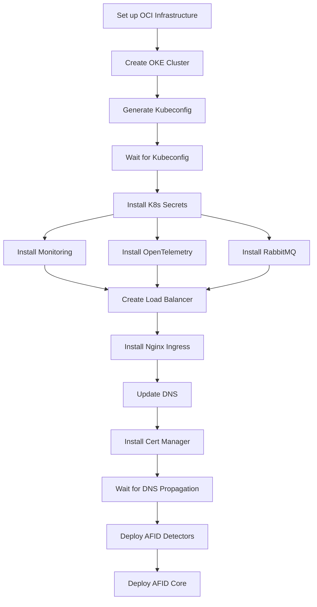

# AFID Infrastructure Setup Guide

This comprehensive guide explains how to set up the complete infrastructure for the AFID application on Oracle Cloud Infrastructure (OCI) using Terraform.

## Table of Contents

- [AFID Infrastructure Setup Guide](#afid-infrastructure-setup-guide)
  - [Table of Contents](#table-of-contents)
  - [Overview](#overview)
  - [Architecture](#architecture)
  - [Prerequisites](#prerequisites)
  - [Terraform Workflow](#terraform-workflow)
  - [Configuration Variables](#configuration-variables)
    - [Required Variables](#required-variables)
    - [Optional Variables](#optional-variables)
  - [Deployment Process](#deployment-process)
  - [Component Configuration](#component-configuration)
    - [OKE Cluster](#oke-cluster)
    - [Load Balancer](#load-balancer)
    - [Monitoring Stack](#monitoring-stack)
    - [OpenTelemetry](#opentelemetry)
    - [RabbitMQ](#rabbitmq)
    - [Nginx Ingress](#nginx-ingress)
    - [Cert Manager](#cert-manager)
    - [DNS Configuration](#dns-configuration)
  - [Fine-Tuning](#fine-tuning)
    - [Production Recommendations](#production-recommendations)
    - [Development Recommendations](#development-recommendations)
  - [Troubleshooting](#troubleshooting)
    - [Common Issues](#common-issues)
    - [Debugging Steps](#debugging-steps)
  - [Cleanup](#cleanup)
  - [Conclusion](#conclusion)

## Overview

The AFID infrastructure setup automates the deployment of a complete application stack on Oracle Cloud Infrastructure (OCI), including:

- Oracle Kubernetes Engine (OKE) cluster
- Load balancer for ingress traffic
- Monitoring with Loki, Grafana, and Vector
- Distributed tracing with OpenTelemetry and Tempo
- Message broker with RabbitMQ
- Ingress controller with Nginx
- TLS certificates with cert-manager and Let's Encrypt
- DNS configuration with Cloudflare
- Application deployment with Helm charts

This guide will walk you through the entire setup process, from configuring variables to fine-tuning the deployment for your specific needs.

## Architecture

The following diagram illustrates the high-level architecture of the AFID infrastructure:

```
                                                  ┌───────────────────────────────────────────────────────────────┐
                                                  │                   Oracle Cloud Infrastructure                  │
                                                  │                                                               │
                                                  │  ┌─────────────────────────────────────────────────────────┐  │
                                                  │  │                    Virtual Cloud Network                 │  │
                                                  │  │                                                         │  │
┌─────────────┐     HTTPS      ┌──────────────┐  │  │  ┌────────────┐    ┌────────────────────────────────┐  │  │
│             │     request     │              │  │  │  │            │    │      Oracle Kubernetes Engine  │  │  │
│  Cloudflare ├────────────────►  OCI Load    ├─────────►   Nginx   │    │                                │  │  │
│    DNS      │                │  Balancer    │  │  │  │  Ingress   │    │  ┌─────────┐    ┌─────────┐   │  │  │
│             │                │              │  │  │  │            │    │  │ AFID    │    │ AFID    │   │  │  │
└─────────────┘                └──────────────┘  │  │  └─────┬──────┘    │  │ Core    │    │ Detectors│   │  │  │
                                                  │  │        │           │  │         │    │         │   │  │  │
                                                  │  │        │           │  └─────────┘    └─────────┘   │  │  │
                                                  │  │        │           │                               │  │  │
                                                  │  │        │           │  ┌─────────┐    ┌─────────┐   │  │  │
                                                  │  │        │           │  │         │    │         │   │  │  │
                                                  │  │        └───────────┼──► RabbitMQ│    │ Grafana │   │  │  │
                                                  │  │                    │  │         │    │         │   │  │  │
                                                  │  │                    │  └─────────┘    └─────────┘   │  │  │
                                                  │  │                    │                               │  │  │
                                                  │  │                    │  ┌─────────┐    ┌─────────┐   │  │  │
                                                  │  │                    │  │         │    │         │   │  │  │
                                                  │  │                    │  │  Loki   │    │ Tempo   │   │  │  │
                                                  │  │                    │  │         │    │         │   │  │  │
                                                  │  │                    │  └─────────┘    └─────────┘   │  │  │
                                                  │  │                    │                               │  │  │
                                                  │  │                    └────────────────────────────────┘  │  │
                                                  │  │                                                         │  │
                                                  │  └─────────────────────────────────────────────────────────┘  │
                                                  │                                                               │
                                                  └───────────────────────────────────────────────────────────────┘
```

## Prerequisites

Before you begin, ensure you have the following:

1. **Oracle Cloud Infrastructure (OCI) Account**
   - Access to create resources in a compartment
   - API keys configured for Terraform

2. **Terraform**
   - Version 1.3.0 or higher installed
   - Basic knowledge of Terraform concepts

3. **OCI CLI**
   - Configured with API keys
   - Proper permissions set up

4. **Cloudflare Account**
   - API token with Zone.DNS permissions
   - Access to the domain you want to use

5. **GitHub Token**
   - With access to the AFID repositories
   - Permissions to pull container images

6. **Local Environment**
   - SSH key pair for accessing instances
   - `kubectl` installed for Kubernetes interaction

## Terraform Workflow

The Terraform workflow for deploying the AFID infrastructure follows these steps:



1. **Initialize Terraform**
   ```bash
   terraform init
   ```

2. **Configure Variables**
   - Copy `terraform.tfvars.example` to `terraform.tfvars`
   - Edit the variables according to your requirements

3. **Plan Deployment**
   ```bash
   terraform plan
   ```

4. **Apply Configuration**
   ```bash
   terraform apply
   ```

5. **Verify Resources**
   - Check OCI Console for created resources
   - Use `kubectl` to verify Kubernetes resources

## Configuration Variables

### Required Variables

The following variables must be set in your `terraform.tfvars` file:

| Variable | Description | Example |
|----------|-------------|---------|
| `api_fingerprint` | Fingerprint of the API key | `"xx:xx:xx:xx:xx:xx:xx:xx:xx:xx:xx:xx:xx:xx:xx:xx"` |
| `api_private_key_path` | Path to the API private key | `"~/.oci/oci_api_key.pem"` |
| `tenancy_id` | OCID of your tenancy | `"ocid1.tenancy.oc1..xxxxxxxxxxxx"` |
| `user_id` | OCID of your user | `"ocid1.user.oc1..xxxxxxxxxxxx"` |
| `compartment_id` | OCID of the compartment | `"ocid1.compartment.oc1..xxxxxxxxxxxx"` |
| `region` | OCI region | `"us-ashburn-1"` |
| `ssh_public_key_path` | Path to your SSH public key | `"~/.ssh/id_rsa.pub"` |
| `ssh_private_key_path` | Path to your SSH private key | `"~/.ssh/id_rsa"` |
| `cloudflare_api_token` | Cloudflare API token | `"your-cloudflare-api-token"` |
| `cloudflare_zone_id` | Cloudflare zone ID | `"your-cloudflare-zone-id"` |
| `app_subdomain` | Subdomain for the application | `"app.example.com"` |
| `github_token` | GitHub token for accessing repositories | `"ghp_xxxxxxxxxxxx"` |

### Optional Variables

These variables have default values but can be customized:

| Variable | Description | Default | Recommended |
|----------|-------------|---------|------------|
| `enable_monitoring` | Enable monitoring stack | `false` | `true` for production |
| `enable_otel` | Enable OpenTelemetry | `false` | `true` for production |
| `create_load_balancer` | Create a dedicated load balancer | `true` | `true` for production |
| `lb_min_bandwidth` | Minimum bandwidth for load balancer | `10` | `10` for small, `50` for medium |
| `lb_max_bandwidth` | Maximum bandwidth for load balancer | `100` | `100` for small, `500` for medium |
| `kubernetes_version` | OKE Kubernetes version | `"v1.32.1"` | Latest stable version |
| `worker_pool_size` | Number of worker nodes | `2` | `3` for production |
| `worker_shape` | Shape of worker nodes | `"VM.Standard.E4.Flex"` | Depends on workload |
| `worker_ocpus` | OCPUs for worker nodes | `2` | `4` for production |
| `worker_memory` | Memory for worker nodes (GB) | `16` | `32` for production |

## Deployment Process

The deployment process follows this sequence:



1. **Set up OCI Infrastructure**
   - Create VCN, subnets, security lists
   - Configure network security groups

2. **Create OKE Cluster**
   - Set up control plane
   - Create worker nodes

3. **Generate Kubeconfig**
   - Create kubeconfig file for cluster access
   - Add 30-second delay for availability

4. **Install Kubernetes Secrets**
   - Create secrets for various components

5. **Install Components**
   - Monitoring stack (if enabled)
   - OpenTelemetry (if enabled)
   - RabbitMQ

6. **Create Load Balancer**
   - Set up OCI Load Balancer
   - Configure backend sets and listeners

7. **Install Nginx Ingress**
   - Configure to use pre-created load balancer

8. **Update DNS**
   - Configure Cloudflare DNS with load balancer IP

9. **Install Cert Manager**
   - Set up Let's Encrypt integration

10. **Deploy Applications**
    - AFID Detectors
    - AFID Core

## Component Configuration

### OKE Cluster

The Oracle Kubernetes Engine (OKE) cluster is the foundation of the infrastructure. Key configuration options:

```hcl
# Cluster configuration
create_cluster     = true
cluster_name       = "afid_oke"
kubernetes_version = "v1.32.1"
cni_type           = "flannel"
pods_cidr          = "10.244.0.0/16"
services_cidr      = "10.96.0.0/16"

# Worker pool configuration
worker_pools = {
  static = {
    shape              = "VM.Standard.E4.Flex",
    ocpus              = 2,
    memory             = 16,
    size               = 2,
    boot_volume_size   = 200,
    kubernetes_version = "v1.32.1"
  }
  dynamic = {
    shape              = "VM.Standard.E4.Flex",
    ocpus              = 2,
    memory             = 16,
    size               = 1,
    boot_volume_size   = 200,
    kubernetes_version = "v1.32.1",
    autoscaling = {
      enabled  = true
      min_size = 1
      max_size = 4
    }
  }
}
```

**Fine-tuning options:**
- Adjust `worker_pools` configuration based on workload requirements
- Enable autoscaling for dynamic workloads
- Increase `boot_volume_size` for applications with large storage needs

### Load Balancer

The load balancer handles incoming traffic to the cluster. Key configuration options:

```hcl
# Load balancer configuration
create_load_balancer = true
lb_subnet_ids        = ["ocid1.subnet.oc1..."]
lb_name_prefix       = "afid"
lb_min_bandwidth     = 10
lb_max_bandwidth     = 100
lb_is_private        = false
lb_nsg_ids           = []
```

**Fine-tuning options:**
- Adjust bandwidth based on expected traffic
- Use network security groups for enhanced security
- Set `lb_is_private` to `true` for internal applications

### Monitoring Stack

The monitoring stack includes Loki, Grafana, and Vector. Key configuration options:

```hcl
# Monitoring configuration
enable_monitoring    = true
monitoring_namespace = "monitoring"
loki_helm_version    = "5.41.6"
grafana_helm_version = "7.0.21"
vector_helm_version  = "0.28.0"
```

**Fine-tuning options:**
- Customize Grafana dashboards
- Adjust retention periods for logs
- Configure alerting rules

### OpenTelemetry

OpenTelemetry provides distributed tracing with Tempo. Key configuration options:

```hcl
# OpenTelemetry configuration
enable_otel               = true
otel_namespace            = "opentelemetry"
otel_collector_helm_version = "0.70.0"
tempo_helm_version        = "1.14.0"
```

**Fine-tuning options:**
- Configure sampling rates
- Adjust retention periods for traces
- Set up custom exporters

### RabbitMQ

RabbitMQ serves as the message broker. Key configuration options:

```hcl
# RabbitMQ configuration
rabbitmq_namespace        = "rabbitmq"
rabbitmq_helm_version     = "12.0.3"
rabbitmq_auth_password    = "your-secure-password"
rabbitmq_auth_erlang_cookie = "your-secure-cookie"
```

**Fine-tuning options:**
- Configure high availability
- Set up additional users and permissions
- Adjust resource limits

### Nginx Ingress

Nginx Ingress handles routing of HTTP traffic. Key configuration options:

```hcl
# Nginx Ingress configuration
ingress_namespace         = "ingress-nginx"
nginx_ingress_helm_version = "4.8.3"
```

**Fine-tuning options:**
- Configure custom headers
- Adjust buffer sizes
- Set up rate limiting

### Cert Manager

Cert Manager handles TLS certificates. Key configuration options:

```hcl
# Cert Manager configuration
cert_manager_namespace    = "cert-manager"
cert_manager_helm_version = "v1.13.3"
letsencrypt_email         = "your-email@example.com"
letsencrypt_server        = "https://acme-v02.api.letsencrypt.org/directory"
```

**Fine-tuning options:**
- Use staging server for testing
- Configure certificate renewal settings
- Set up custom certificate issuers

### DNS Configuration

DNS is managed through Cloudflare. Key configuration options:

```hcl
# DNS configuration
cloudflare_zone_id = "your-zone-id"
app_subdomain      = "app.example.com"
```

**Fine-tuning options:**
- Configure additional DNS records
- Adjust TTL values
- Set up proxying through Cloudflare

## Fine-Tuning

### Production Recommendations

For production environments, consider these adjustments:

1. **Increase Worker Resources**
   ```hcl
   worker_pools = {
     static = {
       shape              = "VM.Standard.E4.Flex",
       ocpus              = 4,
       memory             = 32,
       size               = 3,
       boot_volume_size   = 200,
       kubernetes_version = "v1.32.1"
     }
   }
   ```

2. **Enable High Availability**
   - Deploy across multiple availability domains
   - Use regional subnets

3. **Enhance Security**
   - Use private endpoints where possible
   - Implement network security groups
   - Enable encryption for sensitive data

4. **Optimize Load Balancer**
   ```hcl
   lb_min_bandwidth     = 50
   lb_max_bandwidth     = 500
   ```

5. **Configure Backups**
   - Set up regular backups for persistent volumes
   - Implement disaster recovery procedures

### Development Recommendations

For development environments, consider these adjustments:

1. **Reduce Resources**
   ```hcl
   worker_pools = {
     static = {
       shape              = "VM.Standard.E4.Flex",
       ocpus              = 1,
       memory             = 8,
       size               = 1,
       boot_volume_size   = 100,
       kubernetes_version = "v1.32.1"
     }
   }
   ```

2. **Use Let's Encrypt Staging**
   ```hcl
   letsencrypt_server = "https://acme-staging-v02.api.letsencrypt.org/directory"
   ```

3. **Disable Components**
   ```hcl
   enable_monitoring = false
   enable_otel       = false
   ```

## Troubleshooting

### Common Issues

1. **Terraform Apply Fails**
   - Check OCI API key permissions
   - Verify compartment access
   - Check service limits in your tenancy

2. **Kubernetes Resources Not Deploying**
   - Verify kubeconfig is correct
   - Check for namespace issues
   - Look for resource quota limitations

3. **Load Balancer Issues**
   - Verify subnet configuration
   - Check security list rules
   - Ensure service annotations are correct

4. **Certificate Issues**
   - Verify DNS is properly configured
   - Check Let's Encrypt rate limits
   - Ensure HTTP-01 challenge can complete

### Debugging Steps

1. **Check Terraform State**
   ```bash
   terraform state list
   terraform state show <resource>
   ```

2. **Examine Kubernetes Resources**
   ```bash
   export KUBECONFIG=./oke-config
   kubectl get pods --all-namespaces
   kubectl describe pod <pod-name>
   kubectl logs <pod-name>
   ```

3. **Verify Load Balancer**
   ```bash
   kubectl get svc -n ingress-nginx
   ```

4. **Check Certificate Status**
   ```bash
   kubectl get certificates -A
   kubectl get challenges -A
   ```

## Cleanup

To remove all resources created by Terraform:

```bash
terraform destroy
```

**Note:** This will delete all resources including the Kubernetes cluster and any data stored in it. Make sure to back up any important data before running this command.

For selective cleanup, you can target specific resources:

```bash
terraform destroy -target=module.load_balancer
```

## Conclusion

This guide provides a comprehensive overview of setting up the AFID infrastructure on Oracle Cloud Infrastructure. By following these instructions and fine-tuning the configuration to your specific needs, you can deploy a robust, scalable, and secure application environment.

For additional assistance or to report issues, please contact the AFID infrastructure team.
