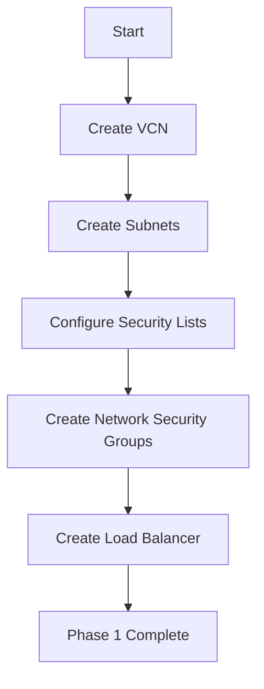
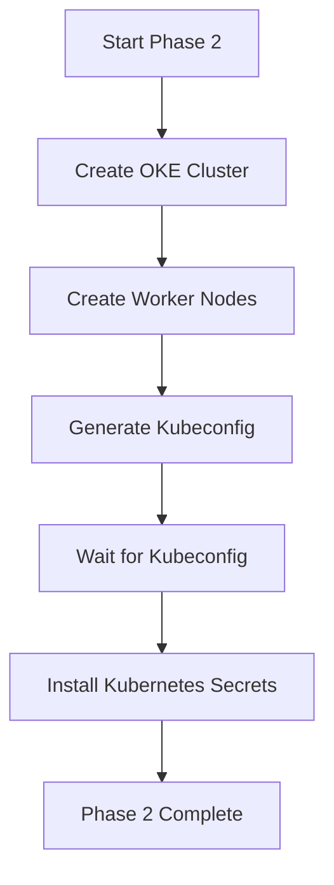
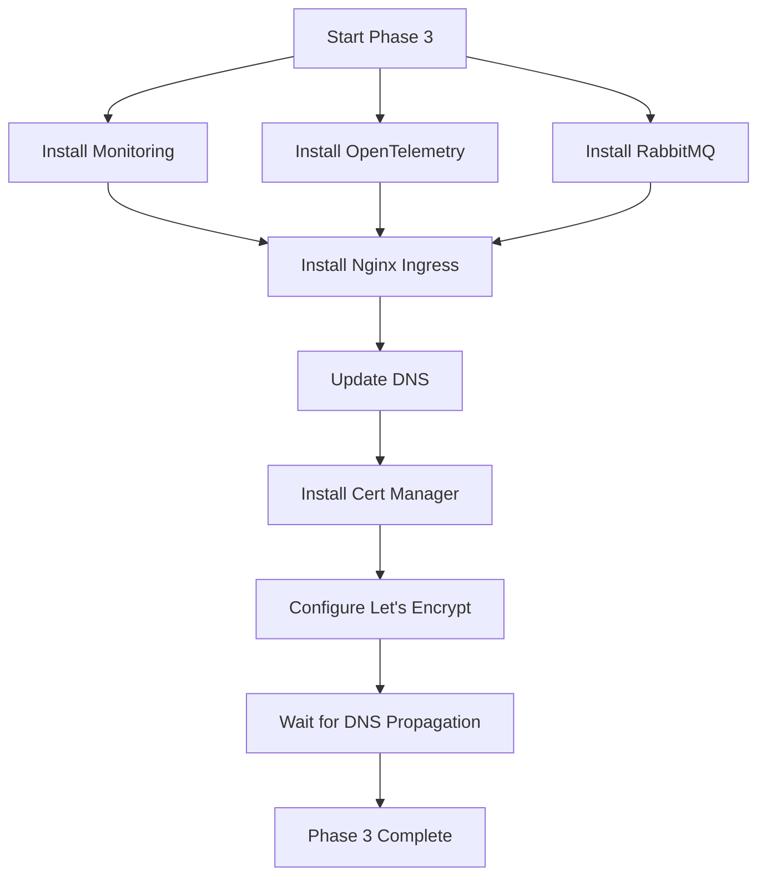
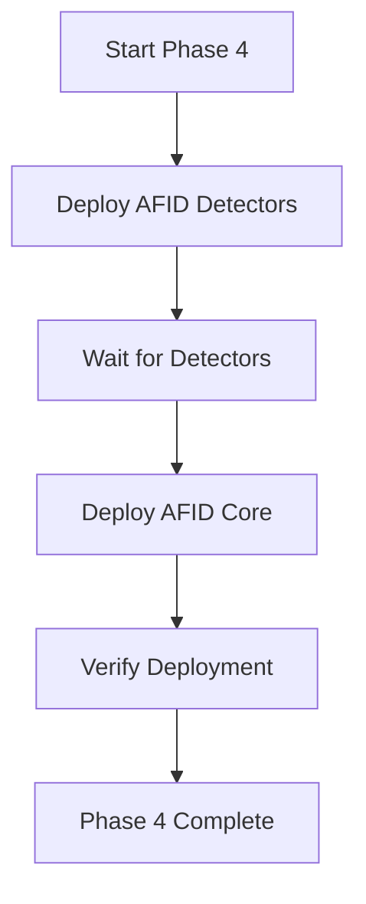
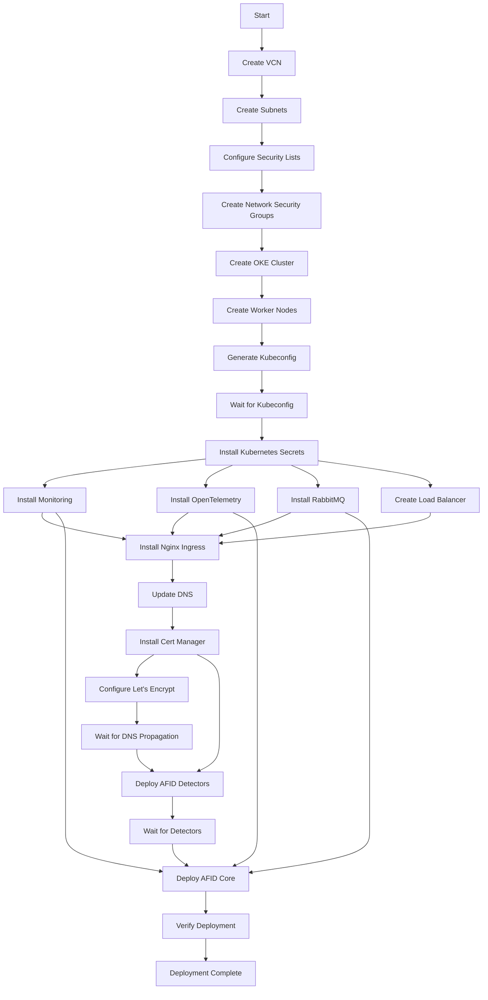

# Deployment Workflow Guide

This guide provides a detailed walkthrough of the deployment workflow for the AFID infrastructure.

## Table of Contents

- [Deployment Phases](#deployment-phases)
- [Phase 1: Infrastructure Setup](#phase-1-infrastructure-setup)
- [Phase 2: Kubernetes Configuration](#phase-2-kubernetes-configuration)
- [Phase 3: Component Installation](#phase-3-component-installation)
- [Phase 4: Application Deployment](#phase-4-application-deployment)
- [Workflow Diagram](#workflow-diagram)
- [Dependency Graph](#dependency-graph)
- [Execution Timeline](#execution-timeline)
- [Verification Steps](#verification-steps)

## Deployment Phases

The deployment process is divided into four main phases:

1. **Infrastructure Setup**: Creating the underlying OCI resources
2. **Kubernetes Configuration**: Setting up the Kubernetes cluster
3. **Component Installation**: Installing supporting services
4. **Application Deployment**: Deploying the AFID application

## Phase 1: Infrastructure Setup

This phase sets up the underlying OCI infrastructure.



### Steps in Detail

1. **Create Virtual Cloud Network (VCN)**
   - Creates a new VCN with the specified CIDR block
   - Sets up DNS resolution
   - Configures internet gateway

2. **Create Subnets**
   - Creates public and private subnets
   - Configures route tables
   - Sets up security lists

3. **Configure Security Lists**
   - Sets up ingress and egress rules
   - Configures access to Kubernetes API
   - Sets up worker node communication

4. **Create Network Security Groups**
   - Creates NSGs for different components
   - Configures fine-grained security rules
   - Sets up service-to-service communication

5. **Create Load Balancer**
   - Creates a flexible shape load balancer
   - Configures backend sets for HTTP and HTTPS
   - Sets up listeners on ports 80 and 443

## Phase 2: Kubernetes Configuration

This phase sets up the Kubernetes cluster and basic configuration.



### Steps in Detail

1. **Create OKE Cluster**
   - Creates the Kubernetes control plane
   - Configures Kubernetes version and settings
   - Sets up cluster networking

2. **Create Worker Nodes**
   - Creates worker node pools
   - Configures node shapes and resources
   - Sets up autoscaling if enabled

3. **Generate Kubeconfig**
   - Retrieves cluster credentials
   - Creates kubeconfig file
   - Sets file permissions

4. **Wait for Kubeconfig**
   - Adds a 30-second delay
   - Ensures kubeconfig is available
   - Prepares for Kubernetes resource creation

5. **Install Kubernetes Secrets**
   - Creates secrets for various components
   - Sets up credentials for external services
   - Configures access to storage

## Phase 3: Component Installation

This phase installs supporting services on the Kubernetes cluster.



### Steps in Detail

1. **Install Monitoring Stack** (if enabled)
   - Installs Loki for log storage
   - Installs Vector for log collection
   - Installs Grafana for visualization

2. **Install OpenTelemetry** (if enabled)
   - Installs Tempo for trace storage
   - Installs OpenTelemetry Collector
   - Configures trace sampling and export

3. **Install RabbitMQ**
   - Installs RabbitMQ server
   - Configures management dashboard
   - Sets up credentials

4. **Install Nginx Ingress**
   - Installs Nginx Ingress Controller
   - Configures it to use the pre-created load balancer
   - Sets up default backend

5. **Update DNS**
   - Updates Cloudflare DNS with load balancer IP
   - Configures wildcard DNS record
   - Sets up main domain record

6. **Install Cert Manager**
   - Installs cert-manager
   - Configures Let's Encrypt integration
   - Sets up ClusterIssuer

7. **Wait for DNS Propagation**
   - Adds a 60-second delay
   - Ensures DNS changes have propagated
   - Prepares for certificate issuance

## Phase 4: Application Deployment

This phase deploys the AFID application components.



### Steps in Detail

1. **Deploy AFID Detectors**
   - Installs the AFID Detectors Helm chart
   - Configures detector settings
   - Sets up service accounts and permissions

2. **Wait for Detectors**
   - Waits for detector pods to be ready
   - Ensures services are available
   - Prepares for core deployment

3. **Deploy AFID Core**
   - Installs the AFID Core Helm chart
   - Configures core settings
   - Sets up ingress resources

4. **Verify Deployment**
   - Checks pod status
   - Verifies service endpoints
   - Ensures ingress is properly configured

## Workflow Diagram

The following diagram shows the complete deployment workflow with all dependencies:



## Dependency Graph

The following table shows the dependencies between components:

| Component | Depends On |
|-----------|------------|
| VCN | - |
| Subnets | VCN |
| Security Lists | Subnets |
| Network Security Groups | VCN |
| OKE Cluster | VCN, Subnets, Security Lists, Network Security Groups |
| Worker Nodes | OKE Cluster |
| Kubeconfig | OKE Cluster |
| Kubernetes Secrets | Kubeconfig |
| Monitoring | Kubernetes Secrets |
| OpenTelemetry | Kubernetes Secrets |
| RabbitMQ | Kubernetes Secrets |
| Load Balancer | VCN, Subnets, Network Security Groups |
| Nginx Ingress | Kubeconfig, Load Balancer |
| DNS | Nginx Ingress, Load Balancer |
| Cert Manager | Kubeconfig |
| Let's Encrypt | Cert Manager, DNS |
| AFID Detectors | Cert Manager, Nginx Ingress |
| AFID Core | AFID Detectors, RabbitMQ, Monitoring, OpenTelemetry |

## Execution Timeline

The following timeline shows the approximate execution time for each phase:

| Phase | Component | Approximate Time |
|-------|-----------|------------------|
| 1 | VCN and Network | 2-3 minutes |
| 1 | Load Balancer | 3-5 minutes |
| 2 | OKE Cluster | 5-7 minutes |
| 2 | Worker Nodes | 3-5 minutes |
| 2 | Kubeconfig | 1 minute |
| 2 | Kubernetes Secrets | 1 minute |
| 3 | Monitoring | 2-3 minutes |
| 3 | OpenTelemetry | 2-3 minutes |
| 3 | RabbitMQ | 2-3 minutes |
| 3 | Nginx Ingress | 1-2 minutes |
| 3 | DNS | 1 minute |
| 3 | Cert Manager | 1-2 minutes |
| 3 | DNS Propagation | 1 minute |
| 4 | AFID Detectors | 2-3 minutes |
| 4 | AFID Core | 3-5 minutes |
| **Total** | | **30-45 minutes** |

## Verification Steps

After deployment, verify the following:

### 1. Infrastructure Verification

```bash
# List OCI resources
terraform state list | grep oci_

# Check load balancer
terraform state show module.load_balancer[0].oci_load_balancer_load_balancer.nginx_ingress_lb
```

### 2. Kubernetes Verification

```bash
# Set kubeconfig
export KUBECONFIG=./oke-config

# Check nodes
kubectl get nodes

# Check pods
kubectl get pods --all-namespaces

# Check services
kubectl get svc --all-namespaces
```

### 3. Component Verification

```bash
# Check monitoring
kubectl get pods -n monitoring

# Check OpenTelemetry
kubectl get pods -n opentelemetry

# Check RabbitMQ
kubectl get pods -n rabbitmq

# Check ingress
kubectl get pods -n ingress-nginx
```

### 4. Application Verification

```bash
# Check AFID Detectors
kubectl get pods -n default -l app=afid-detectors

# Check AFID Core
kubectl get pods -n default -l app=afid-core

# Check ingress resources
kubectl get ingress --all-namespaces
```

### 5. Certificate Verification

```bash
# Check certificates
kubectl get certificates --all-namespaces

# Check certificate issuers
kubectl get clusterissuers
```

### 6. Access Verification

Use the following URLs to verify access:

- Main application: `https://<subdomain>`
- Grafana dashboard: `https://monitoring.<subdomain>`
- RabbitMQ management: `https://rabbitmq.<subdomain>`

## Troubleshooting Common Issues

If you encounter issues during deployment, check the following:

### Infrastructure Issues

- Verify OCI API key permissions
- Check service limits in your tenancy
- Verify network configuration

### Kubernetes Issues

- Check worker node status
- Verify kubeconfig is correct
- Check for resource quota limitations

### Component Issues

- Check pod logs for errors
- Verify Helm releases are deployed
- Check for configuration issues

### Certificate Issues

- Verify DNS is properly configured
- Check Let's Encrypt rate limits
- Ensure HTTP-01 challenge can complete
